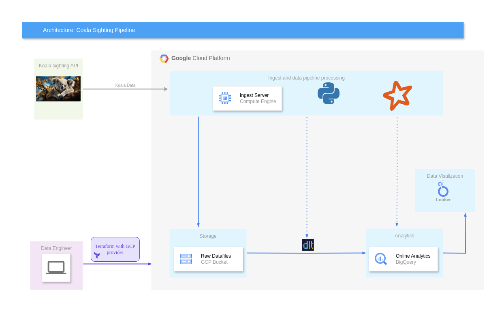

# Final project for Data Enginnering Zoomcamp 2024
## Problem description
There are lots of wild koalas in Queensland, Australia. One can report koalas sighting to the Department of Environment, Science and Innovation by using the free  [QWildLife app](https://environment.des.qld.gov.au/wildlife/animals/living-with/koalas/report-sightings). All sightings are then saved on the corresponding server and can be retrieved using [spatial-gis server's endpoint](https://spatial-gis.information.qld.gov.au/arcgis/rest/services/QWise/CrocodileSightingsPublicView/FeatureServer/30).

In this pet project we collect coala sightings events in a batch manner,  save the raw data to GCP bucket, then injest them to GCP BQ (DWH in our case) using dlt, after this using PySpark we calculate the overall statistics for health/dead/injured koalas as well as total number of koalas seen on a particular day. Finally we visualize the corresponding values using Google Looker.
**Remark**: For this scale of data the project is certainly overengineered.
## Technical description of a project
The project is built as the following

The code's structure can be taken from the next scheme:

    ├── README.md               <- the top-level README.
    ├── prefect.yaml            <- configuration of prefect deployments.
    ├── Pipfile                 <- project libraries requirements.
    ├── Pipfile.lock            <- file that defines dependency tree.
    ├── config.ini              <- configuration data of GCP services used in code. 
    ├── visualization           <- folder with images.        
    ├── scripts                 <- bash scripts for deployment.
    ├── src
    │   ├── definitions.py                 <- parsing and defining a configuration.
    │   ├── ingestion_to_bq_pipeline.py    <- dlt pipeline for ingestions to BQ.
    │   ├── koala_data_processing.py       <- processing of koala data.  
    │   ├── schemas.py              <- schemas used in pipelines.
    │   ├── flows                   <- prefect flows 
    │       ├── dwh_flows.py        <- prefect flows for DWH analytics 
    │       ├── ingestion_flows.py  <- prefect flows for GCP ingection.     
    │   
    ├── infra             <- terrafrom scripts.   
    ├── docs              <-  various documents and readmes.
    ├── .vscode           <-  folder for .vscode settings.
    ├── .prefect          <-  definition of prefect flows.
    ├── .dlt              <-  folder for .dlt services.

### IaC/Cloud
TEST
### Data ingestion: batch
TEST
### Data warehouse: BigQuery
TEST
### Transformations: Spark
TEST
### Dashboard: Google Looker
TEST
## Visualizing graphics:
Here is a link to the Looker Studio report:
https://lookerstudio.google.com/reporting/015ce847-729a-4297-8085-b51c5216e0bc/page/HUttD

A snapshot of this report can be found in _visualization_ folder.