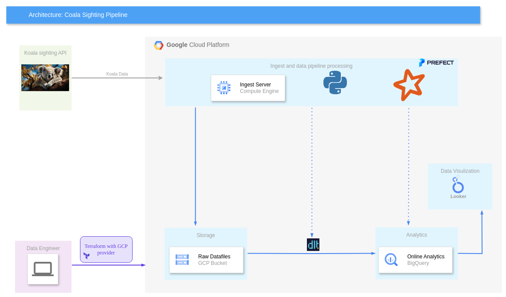

# Final project for Data Enginnering Zoomcamp 2024

## Problem description
There are lots of wild koalas in Queensland, Australia. One can report koalas sighting to the Department of Environment, Science and Innovation by using the free  [QWildLife app](https://environment.des.qld.gov.au/wildlife/animals/living-with/koalas/report-sightings). All sightings are then saved on the corresponding server and can be retrieved using [spatial-gis server's endpoint](https://spatial-gis.information.qld.gov.au/arcgis/rest/services/QWise/CrocodileSightingsPublicView/FeatureServer/30).

In this pet project we collect coala sightings events in a batch manner,  save the raw data to GCP bucket, then injest them to GCP BQ (DWH in our case) using dlt, after this using PySpark we calculate the overall statistics for health/dead/injured koalas as well as total number of koalas seen on a particular day. Finally we visualize the corresponding values using Google Looker.

This version of a project uses GCP Cloud Run as an executor and Prefect Cloud for an orchestration.

**Remark**: For this scale of data the project is certainly overengineered.
## Technical description of a project
The project is built as the following

The code's structure can be taken from the next scheme:

    ├── README.md               <- the top-level README.
    ├── prefect.yaml            <- configuration of prefect deployments.
    ├── Pipfile                 <- project libraries requirements.
    ├── Pipfile.lock            <- file that defines dependency tree.
    ├── config.ini              <- configuration data of GCP services used in code. 
    ├── visualization           <- folder with images.        
    ├── scripts                 <- bash scripts for deployment.
    ├── src
    │   ├── definitions.py                 <- parsing and defining a configuration.
    │   ├── ingestion_to_bq_pipeline.py    <- dlt pipeline for ingestions to BQ.
    │   ├── koala_data_processing.py       <- processing of koala data.  
    │   ├── schemas.py              <- schemas used in pipelines.
    │   ├── flows                   <- prefect flows 
    │       ├── dwh_flows.py        <- prefect flows for DWH analytics 
    │       ├── ingestion_flows.py  <- prefect flows for GCP ingection.     
    │   
    ├── infra             <- terrafrom scripts.   
    ├── docs              <-  various documents and readmes.
    ├── .vscode           <-  folder for .vscode settings.
    ├── .prefect          <-  definition of prefect flows.
    ├── .dlt              <-  folder for .dlt services.

### IaC/Cloud

We use Terraform to provision an infrastructure for the project:
  - GCP Service Accounts
  - GCP BigQuery dataset
  - GCP Bucket
  - GCP Docker Artifact Registry
  
Detailed steps for the provisioning can be found here: [provisioning_infrastructure.md](docs/provisioning_infrastructure.md)
Moreover we use Prefect Cloud to orchestrate our pipelines.
### Data ingestion: batch
Data ingestion is done in a DLT fashion using prefect orchestrator:
1. Every day at 9 p.m. data is loaded to a GCP bucket.
2. After this data from the corresponding csv file is transformed and loaded into a BigQuery dataset using dlt service.
There are 2 flows assosiated with ingesting. Those are 'Initial koalas sighting to BQ' (for the initial load of the historical data) and 'Current koalas sighting to BQ' (scheduled for 8 PM on the every day basis).

The above mentioned operations/worklfows are executed using **GCP Cloud Run**. This works pretty good with small batch operations, since we only pay for the time a cloud run function is being executed.
### Data warehouse: BigQuery
The resulted table 'koala' is clustered using 'sighttime' column and    partitioned by 'sightdate' column. After using 'analytic' pipeline tables 'historical_koala_data'
and 'health_koala_data' are created and filled.
### Transformations: Spark
Spark (as well as PySpark) is used for 'analytical' part of the project, e.g. we calculate the overall statistics for health/dead/injured koalas , saved into 'health_koala_data tabel, as well as total number of koalas seen on a particular day, saved into 'historical_koala_data' table.
There are 2 flows assosiated with transformations and analysis on the DWH. Those are 'Health data' and 'Summarized historical data'.
### Dashboard: Google Looker
The visualization is done using Looker Studio. It is impossible to save a code for it. Here is a link to the Looker Studio [report](https://lookerstudio.google.com/reporting/015ce847-729a-4297-8085-b51c5216e0bc/page/HUttD).
A snapshot of this report can be found in _visualization_ folder ( Meeting_Koalas.pdf).