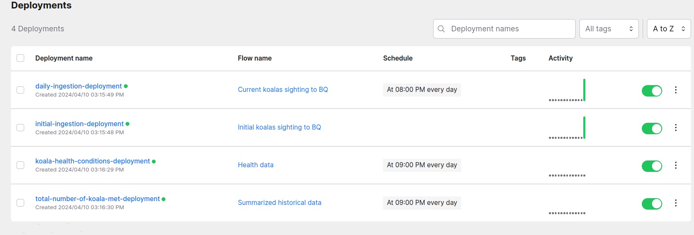

0. Log in into GCP VM using SSH (standard way).
1. Clone and go to a project directory
```bash
git clone https://github.com/tarasenya/dezoomcamp_final_project.git
cd dezoomcamp_final_project
```
2. Change the project id in a  project field in ```config.ini```
3. Install JDK, Spark and set the corresponding envrionment variables:
```bash
cd scripts
bash install_spark.sh
source ~/.bashrc
```   
4. Create the corresponding python environment:
```bash
bash create_environment.sh
```
4. Start prefect server, deploying the corresponding pipelines and starting the initialization pipeline by:

```bash
cd scripts
bash prefect_script.sh
```
_Remark_: Ignore all warnings.

5. In order to access the prefect server on GCP VM one uses the following command:
```bash
gcloud compute ssh cloudshell --zone=europe-west3-c -- -NL 4200:localhost:4200
```   
6. The deployed pipelines in prefect UI look as the following:

We see that 3 of them are scheduled for 8 PM every day.
7. One can trigger a manual run by just clicking on a pipeline and then "Quick Run".