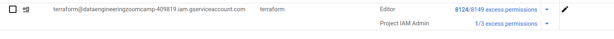

# Provisioning the Infrastructure on GCP.
**The following is assumed:**
0. The project has been cloned into a local environment (laptop):
   ```git clone https://github.com/tarasenya/dezoomcamp_final_project.git```
1. CLI ```gcloud``` is installed and authorised to a GCP account.
2. The GCP project you want to use for the pet-project has been created (then change the variable "project" in ```infra/variables.tf``` to the defined name) and the project is set up as default for  ```gcloud```:
   ```gcloud config set project YOUR_PROJECT_ID```
3. The following APIs has been activated for the project:

| NAME                                	| TITLE                                    	|
|-------------------------------------	|------------------------------------------	|
| analyticshub.googleapis.com         	| Analytics Hub API                        	|
| bigquery.googleapis.com             	| BigQuery API                             	|
| bigqueryconnection.googleapis.com   	| BigQuery Connection API                  	|
| bigquerydatapolicy.googleapis.com   	| BigQuery Data Policy API                 	|
| bigquerymigration.googleapis.com    	| BigQuery Migration API                   	|
| bigqueryreservation.googleapis.com  	| BigQuery Reservation API                 	|
| bigquerystorage.googleapis.com      	| BigQuery Storage API                     	|
| cloudapis.googleapis.com            	| Google Cloud APIs                        	|
| cloudresourcemanager.googleapis.com 	| Cloud Resource Manager API               	|
| cloudtrace.googleapis.com           	| Cloud Trace API                          	|
| compute.googleapis.com              	| Compute Engine API                       	|
| dataform.googleapis.com             	| Dataform API                             	|
| dataplex.googleapis.com             	| Cloud Dataplex API                       	|
| datastore.googleapis.com            	| Cloud Datastore API                      	|
| datastudio.googleapis.com           	| Looker Studio API                        	|
| iam.googleapis.com                  	| Identity and Access Management (IAM) API 	|
| iamcredentials.googleapis.com       	| IAM Service Account Credentials API      	|
| logging.googleapis.com              	| Cloud Logging API                        	|
| looker.googleapis.com               	| Looker (Google Cloud core) API           	|
| monitoring.googleapis.com           	| Cloud Monitoring API                     	|
| oslogin.googleapis.com              	| Cloud OS Login API                       	|
| servicemanagement.googleapis.com    	| Service Management API                   	|
| serviceusage.googleapis.com         	| Service Usage API                        	|
| sql-component.googleapis.com        	| Cloud SQL                                	|
| storage-api.googleapis.com          	| Google Cloud Storage JSON API            	|
| storage-component.googleapis.com    	| Cloud Storage                            	|
| storage.googleapis.com              	| Cloud Storage API                        	|

Remark 1. To list all enabled APIs use:
```bash
gcloud services list --enabled --project YOUR_PROJECT_ID
```
Remark 2. To enable a missing API use:
```gcloud services enable SERVICE_NAME```

**Steps for provisioning:**
1. Create the terraform service account:
(details can be found in the [book](https://github.com/PacktPublishing/Terraform-for-Google-Cloud-Essential-Guide/tree/main) Terrafrom for Google Cloud Essential Guide by B. Nordhausen)
```bash
$ gcloud auth login --no-launch-browser
$ gcloud config set project "<PROJECT_ID>"  
$ gcloud iam service-accounts create terraform \
    --description="Terraform Service Account" \
    --display-name="terraform"

$ export GOOGLE_SERVICE_ACCOUNT=`gcloud iam service-accounts list --format="value(email)"  --filter=description:"Terraform Service Account"` 
$ export GOOGLE_CLOUD_PROJECT=`gcloud info --format="value(config.project)"`
$ gcloud projects add-iam-policy-binding $GOOGLE_CLOUD_PROJECT \
    --member="serviceAccount:$GOOGLE_SERVICE_ACCOUNT" \
    --role="roles/editor" 
$ gcloud projects add-iam-policy-binding $GOOGLE_CLOUD_PROJECT \
    --member="serviceAccount:$GOOGLE_SERVICE_ACCOUNT" \
    --role="roles/resourcemanager.projectIamAdmin"    
$ gcloud iam service-accounts keys create "./terraform.json"  \
  --iam-account=$GOOGLE_SERVICE_ACCOUNT 
```
The account on IAM & Admin service on GCP looks as the following:

2. Go to ```infra``` folder, copy the key ```terraform.json``` obtained in the previous step to this folder and execute (please be informed that this will cost some money):
   ```bash 
   terraform plan
   terraform apply
   # the last command can be substituted by:
   # terraform apply -var project=PROJECT_ID
   ```
3. The infrastructure is provisioned.
   
The next steps after provisioning can be found [here](actions_on_vm.md)